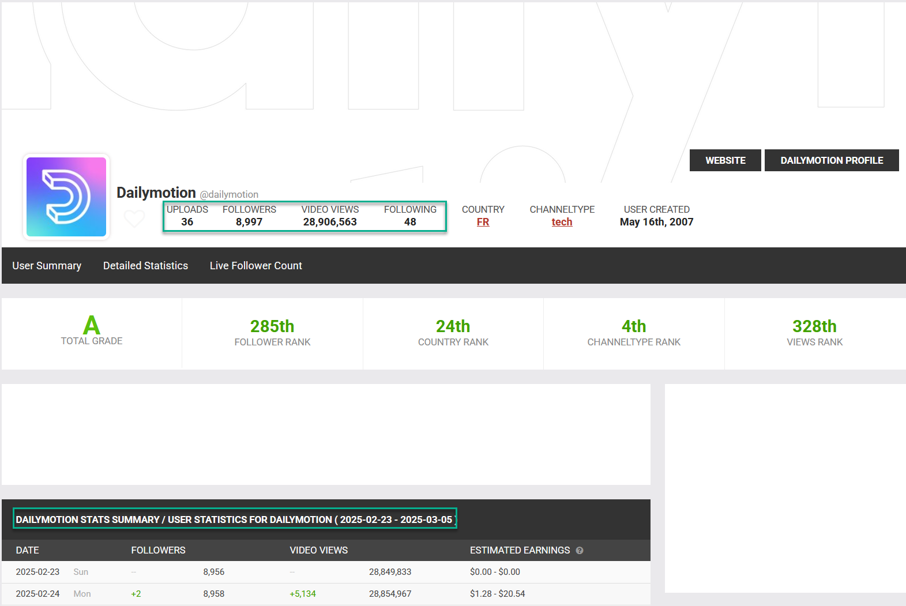

# DAILYMOTION

This document is intended to record the various capabilities of this Online Collection System.

## Assets

All OMCSystems deal in assets. Assets refer to a specific piece of media published on a website.

```
[INSERT TECHNOLOGY STATEMENT]

Asset Profile:
How long are clips?
- ~30 seconds to approximately one hour

How many are produced per day? (month?)
- requires further profiling

How many eyeballs do we think land on these assets?
- metadata can be extacted to determine this

Is there any engagement data visible?
- Asset engagement data is available
- Source engagement data has not been found
```

### Asset Discovery
How do we discover new videos on this website?
- Create a new Discovery application similar to the one used for YouTube News and Trending Discovery

```

[INSERT TECHNOLOGY STATEMENT]


What technology do we use?
- C# .NET Core, Browserless, Selenium
 
How stable is the source?
- Sources are stable

How stable is the discovery integration?
- TBD

How often do we run discovery?
- Hourly

How expensive is it?
- TBD

How many documents do we find?
- TBD

How long does it take to discovery an asset?
- TBD

```

### Asset Enhancement
How do we enrich the content once we have discovered it? (*Maybe we don't have to?*)
- We'll use OVEG to extract Asset metadata

```
[INSERT TECHNOLOGY STATEMENT]

Consider discussing the following

Transcripts: Do we need stt or do we get transcripts another way?
- STT

Audience: Is there audience (or engagement) data available? Could we create some?
- Asset engagement data is available

Summaries: Do we summarize long documents automatically?
- TBD

How expensive is it?
- STT is the most expensive aspect

How long does it take to enhance an asset?
- Comparable to the yt-dlp integration for YouTube in OVEG

```

### Asset Indexing
How and where do we index content?
- An indexer application will handle the process
- Content is indexed in Elasticsearch
```

[TECHNOLOGY STATEMENT]

Consider discussing the following

Location:
Technology:
Longevity:
Volume:
Reindexing: 
```

## Sources

Some OMCSystems need to find sub-sources. For example, finding YouTube Channels on YouTube. These processes are about discovering sources and how we index and enhance them.

### Source Discovery
- Scan categories and channels with Discovery application

### Source Enhancement

Consider [SocialBlade](https://socialblade.com/business-api)

<div align="center">
	
</div>

### Source Indexing

- Create contracts and Indexing application

### Source Revisitation

- Revisit daily following the same workflow as Asset discovery
